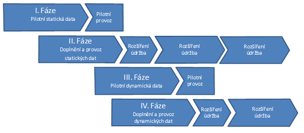

Doporučený postup otevírání dat
===============================

K otevření dat je vhodné postupovat v jednoznačně oddělených fázích, které na
sebe navazují, což umožní využít získané zkušenosti a aplikovat požadavky
uživatelů, které při provozu otevřených dat získáme.

Jednotlivé odbory městských samospráv  často vytvářejí velké množství kvalitních
dat, která jsou potenciálně atraktivní pro širokou škálu uživatelů. Na druhou
stranu zdroje pro otevírání dat jsou omezené, proto je potřeba pečlivě vybírat,
co se bude uvolňovat. Rizikem je vyčerpání energie na datové sady, které nebudou
uživateli příliš využívané a naopak nepokrytí těch, které by byly pro veřejnost
více atraktivní.

V souladu úspěšným postupem ČÚZK je vhodné nejdříve zabezpečit systém
poskytování statických datových sad, tj. těch, které se vygenerují, připraví na
server včetně vyhledávací infrastruktury. Zátěž infrastruktury při využívání
těchto druhů dat je minimální. Teprve ve druhém kroku, s využitím zkušeností při
otevírání statických dat, je vhodné přistoupit k otevírání dat dynamických,
měnících s v čase. Každý krok je rozdělen na pilotní fázi, ve které jsou
otevřeny vhodně vybrané datové sady, u kterých předpokládáme velký zájem
uživatelů, a fázi implementační, ve které jsou aplikovány zkušenosti z pilotní
fáze do přípravy rutinního provozu a systémového otevírání dat. Otevírání
dalších datových sad pokračuje postupně tak, aby byla neustále zabezpečena
kvalita poskytovaných dat a služeb.

Doporučený postup otevírání dat je znázorněn na následujícím schématu:

   Doporučený postup otevírání dat

Příprava datových sad pro zveřejnění by měla zahrnovat následující kroky [ref70]_:

1. Identifikace datových sad pro otevření,
2. kontrola kvality vybraných datových sad - kompletnost, aktuálnost a přesnost,
   geometrická správnost,
3. přidání/kontrola metadat a jejich údržba,
4. volba a přidání licenčních podmínek,
5. fyzické otevření dat publikováním stahovacích/prohlížecích služeb.

Pro identifikaci datových sad je vhodné zvolit kombinaci z následujících
možností:

1. dotazníkové šetření v komunitě uživatelů,
2. analýza požadavků stávajících uživatelů,
3. analýza nákladů na zveřejnění a porovnání s náklady na stávající systém
   distribuce,
4. analýza složitosti zveřejnění (legislativní omezení, čištění dat, …),
5. odhad potřeb/pozorování uživatelů.

Důležité je nejenom jednorázově provést průzkum a odhad potřeb uživatelů, ale
také umožnit uživatelům zpětnou vazbu směrem k poskytovateli, minimálně pomocí
formuláře na webových stránkách.

Otevírání dat je proces, který nikdy nebude možné označit za ukončený. Proto
není cílem otevřít všechny datové sady, které jsou momentálně k dispozici, ale
pracovat na jejich otevírání postupně.

Velice důležitým krokem se jeví popularizace s cílem získat maximální spektrum
potenciálních uživatelů. Zveřejnění v aktualitách portálu města je potřeba
periodicky opakovat pro všechny nové uživatele, minimálně v intervalu dvakrát
ročně. Manažerskou veřejnost je nutné oslovit propagací na konferencích a
workshopech. Odbornou veřejnost a vývojáře potom pomocí hackfestů, hackathonů,
cílených workshopů, cenami pro nejlepší produkt a pod.
