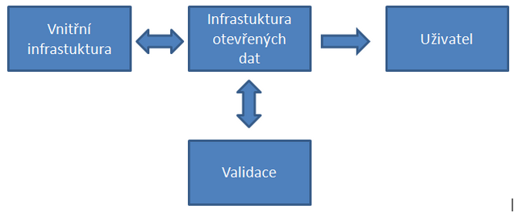

#############
Otevírání dat
#############

*******************************
Doporučený postup otevírání dat
*******************************

K otevření dat je vhodné postupovat v jednoznačně oddělených fázích, které na
sebe navazují, což umožní využít získané zkušenosti a aplikovat požadavky
uživatelů, které při provozu otevřených dat získáme.

Jednotlivé odbory městských samospráv  často vytvářejí velké množství kvalitních
dat, která jsou potenciálně atraktivní pro širokou škálu uživatelů. Na druhou
stranu zdroje pro otevírání dat jsou omezené, proto je potřeba pečlivě vybírat,
co se bude uvolňovat. Rizikem je vyčerpání energie na datové sady, které nebudou
uživateli příliš využívané a naopak nepokrytí těch, které by byly pro veřejnost
více atraktivní.

Pro cílový stav doporučujeme, aby otevřená data byla publikována jako *webové
služby OGC OWS*. Tam, kde se to ukáže jako problematické (např. z důvodu
přílišné zátěže na stávající technickou infrastrukturu), doporučujeme
poskytování statických datových sad, tj. těch, které se vygenerují, připraví na
server včetně vyhledávací infrastruktury s využitím *formátu Atom*.  V druhém
kroku, s využitím zkušeností při otevírání statických dat, je vhodné přistoupit
k otevírání dat dynamických, měnících s v čase. Každý krok je rozdělen na
pilotní fázi, ve které jsou otevřeny vhodně vybrané datové sady, u kterých
předpokládáme velký zájem uživatelů, a fázi implementační, ve které jsou
aplikovány zkušenosti z pilotní fáze do přípravy rutinního provozu a systémového
otevírání dat.  Otevírání dalších datových sad pokračuje postupně tak, aby byla
neustále zabezpečena kvalita poskytovaných dat a služeb.

Doporučený postup otevírání dat je znázorněn na následujícím schématu:

.. figure:: imgs/postup.png
   :scale: 100 %
   :alt: Schéma doporučeného postupu otevírání dat
   :align: center
   
   *Doporučený postup otevírání dat*

Příprava datových sad pro zveřejnění by měla zahrnovat následující kroky [ref70]_:

1. Identifikace datových sad pro otevření,
2. kontrola kvality vybraných datových sad - kompletnost, aktuálnost a přesnost,
   geometrická správnost,
3. přidání/kontrola metadat a jejich údržba,
4. volba a přidání licenčních podmínek,
5. fyzické otevření dat publikováním stahovacích/prohlížecích služeb.

Pro identifikaci datových sad je vhodné zvolit kombinaci z následujících
možností:

1. dotazníkové šetření v komunitě uživatelů,
2. analýza požadavků stávajících uživatelů,
3. analýza nákladů na zveřejnění a porovnání s náklady na stávající systém
   distribuce,
4. analýza složitosti zveřejnění (legislativní omezení, čištění dat, …),
5. odhad potřeb/pozorování uživatelů.

Důležité je nejenom jednorázově provést průzkum a odhad potřeb uživatelů, ale
také umožnit uživatelům zpětnou vazbu směrem k poskytovateli, minimálně pomocí
formuláře na webových stránkách.

Otevírání dat je proces, který nikdy nebude možné označit za ukončený. Proto
není cílem otevřít všechny datové sady, které jsou momentálně k dispozici, ale
pracovat na jejich otevírání postupně.

Velice důležitým krokem se jeví popularizace s cílem získat maximální spektrum
potenciálních uživatelů. Zveřejnění v aktualitách portálu města je potřeba
periodicky opakovat pro všechny nové uživatele, minimálně v intervalu dvakrát
ročně. Manažerskou veřejnost je nutné oslovit propagací na konferencích a
workshopech. Odbornou veřejnost a vývojáře potom pomocí hackfestů, hackathonů,
cílených workshopů, cenami pro nejlepší produkt a pod.

.. index::
    single: Technické řešení

**********************************************
Technické řešení infrastruktury otevřených dat
**********************************************

Při návrhu a budování infrastruktury otevřených dat je vhodné dodržovat několik
základních pravidel, která zabezpečí maximální efektivitu, rozšiřitelnost a
odolnost celého řešení.

* Vnitřní infrastrukturu je nutné logicky, ne nutně fyzicky, oddělit od
  infrastruktury pro poskytování otevřených dat
* Data jsou publikována v souladu s platnými standardy. Je možné, že stávající
  softwarové vybavení nebude tuto podmínku splňovat. Softwarové řešení může být
  hybridní (open source vs. propritary), každopádně takové, aby plnilo daný
  účel.
* Pokud to licenční podmínky umožní, je vhodné v maximální míře využít
  stávajících technologií tak, aby se zbytečně nerozšiřovalo spektrum
  provozovaného software a tím i složitost celého řešení. To znamená, že
  optimální je vnitřní infrastrukturu geografických dat a infrastrukturu dat
  otevřených provozovat na stejné platformě, doplněné o případné nutné další
  technologie tam, kde fyzicky stávající technologie nedostačuje.
* Klíčovým prvkem infrastruktury je validace dat před jejich publikováním.
  validátor příslušného standardu. Validaci samotnou je nutné svěřit jiné části
  týmu, případně externistům, aby byly nalezeny i nepopsané vlastnosti, sdílené
  pouze vnitřními pracovníky.
* Provoz dynamických služeb je vhodné delegovat na externí infrastrukturu, která
  umožní zabezpečit její škálovatelnost a dostupnost podle aktuálního zatížení

   
   *Technická infrastruktura při otevírání dat*

Nasazené řešení je vhodné testovat na co možná nejširší škále běžně používaných
nástrojů z oblasti desktopových GIS aplikací, geodatabází, katalogů a pod. Výběr
referenčního softwaru je vždy ovlivněn osobní preferencí administrátora,
objektivními vlastnostmi, znalostí určitého technologického okruhu. 

.. index::
    single: Validace

Doporučení k validaci
=====================

Publikovaná data v souborových formátech i webové služby by mělo jít snadno
přidat jako vrstvy do tzv. projektů (workspace) v desktopových aplikacích jako
je Esri ArcGIS, GeoMedia, QGIS, případně Topol a další. Pro ověření správnosti
definice souřadnicového systému poskytovaných dat lze použít transformační
nástroje Open Source knihovny GDAL [ref59]_. Dále je pomocí této knihovny vhodné
ověřit konzistenci a validitu dat včetně nastavení kódování češtiny v
poskytovaných datech. To je možné zpětným importem a porovnáním s původními
daty. Knihovna GDAL je taktéž využívána systémem ArcGIS firmy Esri, lze ji tedy
považovat za vhodnou referenční knihovnu. Pro úplnost dodáváme, že za
ekvivaletní řešení ke knihovně GDAL pro prostředí jazyka Java lze považovat
knihovnu GeoTools [ref63]_.

Provázání mezi metadatovým katalogem a samotnou službou je vhodné testovat
pomocí zásuvného modulu QGIS MetaSearch [ref58]_, který umožnuje v katalogu přidat
službu jako vrstvu do projektu. Dále by mělo být možné ověřit validitu služeb
(vyhledávacích ale i prohlížecích a stahovacích) a dat na národním geoportálu
INSPIRE [ref61]_.

Pro automatické testování validity a dostupnosti webových služeb můžeme s
výhodnou využít knihovnu OWSLib [ref62]_, kterou lze spouštět periodicky na serveru
a provádět tak pravidelnou kontrolu.

U poskytovaných geodat, kde předpokládáme migraci na straně uživatele do
geodatabáze, jakou jsou například objemnější data v relační nebo stromové
struktuře, případně soubory se změnovými větami, je na místě tuto migraci
otestovat. Pakliže se zaměříme na Open Source řešení, tak se jako nejvhodnější
referenční geodatabáze jeví PostGIS [ref60]_. Zde je třeba počítat s tím, že postup
nebude triviální a není od věci jej publikovat, například na stránkách IPR. 

Pro ověření funkčnosti a dostupnosti webových služeb, ale i předgenerovaných
rastrových dlaždic prostřednictvím služby OGC WMTS, je vhodné využít i webové
aplikace, např. pomocí knihoven Leaflet [ref64]_ nebo OpenLayers [ref65]_.
