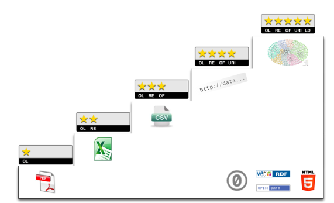

.. index:: 
    single: Veřejná správa
    single: CKAN
    single: Open Data Handbook
    single: OpenStreetMap

####
Úvod
####

Je všeobecně uznávaným faktem, že sebelepší řešení není udržitelné, pokud není
naplněno kvalitními a aktuálními daty. V poslední době dochází v této
souvislosti v čím dál větší míře ke sdílení a šíření dat prostřednictvím sítě
Internet. Pojmy jako *“linked data”* nebo *“sémantický web”* nejsou dávno jen
teoretickým konceptem, ale aktuální skutečností. Bez nadsázky lze říci, že data
jsou jedna z komodit, které podporují jak technický pokrok, tak rozvoj občanské
společnosti. Tento fakt začíná být po vzoru našich nejbližších sousedů,
především Německa, ale i Rakouska či Velké Británie reflektován i veřejnou
správou v České republice v podobě postupného otevírání dat. 

Právě ve Velké Británii vznikly dvě celosvětově nejvýznamnější hnutí v
otevírání dat. Prvním z nich je nezisková organizace `Open Knowledge
Foundation <http://cz.okfn.org/>`_ (OKFN), která se orientuje na
propagaci otevřenosti ve znalostech a datech obecně. OKFN stojí mimo
jiné za projektem katalogu CKAN [ref45]_ a tzv. Open Data Index
(žebříček otevřenosti dat). Tento
žebříček shrnuje úroveň států z pohledu otevřenosti a dostupnosti
nejdůležitějších datových sad jako jsou např. jízdní řády, státní
rozpočet, výsledky voleb, obchodní rejstřík a podobně. Základní
zkušenosti s právními, sociálními a technickými aspekty OKFN shrnuje
publikace *Open Data Handbook* [ref70]_, ze které částečně čerpá i tato
studie. Druhým z uvedených hybatelů je projekt `OpenStreetMap
<http://www.openstreetmap.org/about>`_ (OSM), který byl založen v
roce 2006 právě ve Velké Británii s cílem komunitního vytváření volně
dostupných geografických dat a následně jejich vizualizace do podoby
silniční mapy, uličního plánu měst a dalších výstupů. Vzhledem k tomu,
že je od počátku založen na kolektivní spolupráci a na koncepci Open
Source, se rychle rozšířil do celého světa. Data z projektu OSM jsou
poskytována pod otevřenou licencí Open Database Licence.

Veřejná správa vždy shromažďovala data potřebná pro výkon svých agend.
Zpřístupnění těchto dat umožní veřejnosti nejen využít informace v nich
obsažené, ale především *řádově znásobit jejich hodnotu* tím, že kdokoliv nad nimi
bude moci bez jakéhokoliv omezení postavit vlastní aplikaci či službu, anebo je
podrobit nezávislé analýze. Právě proto je důležité, aby co nejvíce dat
vytvářených veřejnou správou bylo publikováno a volně poskytováno široké
veřejnosti k dalšímu užití. Jen tak může být zcela beze zbytku využit potenciál
dat sbíraných z veřejných prostředků.

Otevírání dat je proces, který se týká několika oblastí. Kromě technických
záležitostí se jedná především o licenční politiku, která v ideálním případě
umožní vývojářům navazujících aplikací data předávat dál a vytvářet nad nimi
další odvozená díla, která nebudou zatěžována žádnými restrikcemi.

Obsahem této studie jsou zejména geografická data (tzv. geodata), která se ve
velké míře řídí na rozdíl od ostatních typů dat vlastními zvyklostmi, standardy
či technickými normami. Proces standardizace je v oblasti geoinformačních
technologií, na rozdíl od jiných technologických oblastí, podporován již delší
dobu, což výrazně ulehčuje tvorbu dalších doporučení. V současnosti drtivá
většina výrobců softwarových produktů (proprietárních i otevřených), ale např. i
Evropská komise skrze směrnici INSPIRE navazuje na
existující standardy v této oblasti, které pomáhá dále rozvíjet. Standardy jsou vytvářeny
mezinárodní standardizační organizací `Open Geospatial Consortium
<http://www.opengeospatial.org/>`_ (OGC) a technickou komisí `ISO TC 211
<http://www.isotc211.org/>`_.  Mezinárodní technické normy ISO mohou následně
být přejímány jako normy národní (označené jako ČSN EN ISO, například ČSN EN ISO
19136 *Geografická informace – Značkovací jazyk geografie (GML)* [ref77]_). 

.. index::
    pair: Otevřená data; Open Data
    pair: Pěti hvězdičkový systém; Fivestar system

*************
Otevřená data
*************

Aby data mohla být označena za *otevřená*, musí splňovat několik
legislativních a technických podmínek (viz níže). Tyto podmínky nejsou v čase
konstantní, vyvíjí se spolu s technickými prostředky, standardy ale i
legislativou či postoji společnosti.

V současnosti těmito podmínkami myslíme zejména:

* Data jsou dostupná na síti Internet a dohledatelná běžnými nástroji
* Data jsou strojově čitelná, tedy v textovém či binárním formátu
* Data musí být úplná, tj. jsou zveřejněná v takovém rozsahu, aby nechyběly
  některé fragmenty umožňující jejich využití. Data by zároveň měla být
  zveřejněna v maximálním možném rozsahu. //musí být úplná vs. zveřejněna v maximálním možném rozsahu - nejasný význam vět//
* Legislativní a technické překážky pro využití dat jsou minimální

.. _pet-hvezdicek:
  
Tim Berners-Lee [ref15]_ sestavil
tzv. *pětihvězdičkový systém* hodnocení otevřenosti dat, jehož smyslem je umožnit
jednoduchou orientaci ve stupni otevřenosti datových sad. Čím výše se datová
sada dostane, tím větší je možnost jejího využití veřejností.

   
   *Pětihvězdičkový systém otevřených dat podle Tim Berners-Lee* [ref15]_

.. raw:: latex

   \newpage

**★ Dostupná data**

    Data jsou zveřejněna na Internetu, nezáleží na formátu.
    Data, která jsou zveřejněna na síti Internet v jakémkoli formátu, ale pod
    otevřenou licencí pro jejich využití. Existují tedy určitá technická omezení pro
    jejich využití, nicméně legislativní omezení jsou odstraněna. Příkladem může být
    mapové dílo ve formátu PDF.

**★★ Strukturovaná data**

    Data jsou zveřejněna ve strojově čitelném formátu.  Data jsou
    zveřejněna ve strojově zpracovatelném formátu, který není
    otevřený.  Příkladem mohou být data ve formátu Microsoft Excel nebo data uložená
    v Esri GeoDatabase.

**★★★ Data v otevřeném formátu**

    Data jsou zveřejněna v otevřeném formátu.  Strojový formát, ve
    kterém jsou data zveřejněna, je otevřený, tj. veřejně publikovaný
    s licencí umožňující jeho využití. Příkladem jsou například
    formáty Geospatial Markup Language (GML), OGC
    GeoPackage 
    nebo Esri Shapefile

**★★★★ Data s identifikátorem**

    Data jsou dohledatelná, mají unikátní identifikátor. Data jsou
    opatřena identifikátorem Uniform Resource Identifier
    (URI), unikátním v rámci celé sítě Internet. Jednotlivé prvky
    datové sady by měly být identifikované pomocí URI ve tvaru
    použitelném pro protokol HTTP
    tzn. v podobě adresy URL. Tím se zajistí, že uživatelé mohou daný
    prvek kdykoli najít.

**★★★★★ Provázaná data**

    Data jsou navzájem prolinkovaná, lze mezi nimi
    navigovat, "surfovat" [ref71]_.  Data jsou nejen identifikovatelná pomocí URI, ale
    obsahují odkazy na další datové sady.  Stejně jako datové sady jsou pomocí
    odkazů provázány i jednotlivé prvky z datových sad. Data jsou dále opatřena
    popisnými informacemi (metadaty) tak, aby v nich bylo možno jednoduše
    vyhledávat. 

Výhody a omezení otevírání dat
==============================
Je potřeba zdůraznit, že proces otevírání dat je oproti stávajícímu stavu navíc
vynaložená práce. Ta je požadována zejména po poskytovateli dat, který, chce-li
se na určitou úroveň otevřenosti dat dostat, musí do stávajících datových sad
dodat požadované chybějící informace.

V této části textu rozebereme pozitiva otevírání dat a požadavky
kladené na poskytovatele otevřených dat, i jejich uživatele.

Výhody ☑ a omezení ☒ – z hlediska uživatele
-------------------------------------------

.. tabularcolumns:: p{.1\textwidth}p{.8\textwidth}

+-------+---------------------------------------------------------------------------------+
| ★     | | ☑ Data lze prohlížet                                                          |
|       | | ☑ Data lze tisknout                                                           |
|       | | ☑ Data lze uložit na lokální disk                                             |
|       | | ☑ Data lze vložit do dalšího systému nebo databáze                            |
|       | | ☑ Data lze podle potřeby a možností použitého formátu měnit, doplňovat či     |
|       | | odvozovat další produkty                                                      |
|       | | ☑ Data je možné sdílet s dalšími uživateli                                    |
+-------+---------------------------------------------------------------------------------+
| ★★    | | ☑ Data lze automaticky zpracovávat pomocí proprietárního software             |
|       | | ☑ Data lze vyexportovat do jiného formátu                                     |
+-------+---------------------------------------------------------------------------------+
| ★★★   | | ☑ Uživatel může manipulovat s daty, aniž by byl závislý na vlastnictví        |
|       | | konkrétního, většinou proprietárního software                                 |
+-------+---------------------------------------------------------------------------------+
| ★★★★  | | ☑ Uživatel může na data odkazovat z kteréhokoli jiného místa na webu          |
|       | | ☑ Lze pořizovat trvalé odkazy na data                                         |
|       | | ☑ Lze znovu použít část dat, aniž by se musela vytvářet jejich fyzická kopie  |
|       | | ☑ Lze kombinovat datové sady mezi sebou, protože použité URI jsou vždy        |
|       | | unikátní                                                                      |
|       | | ☒ Porozumění struktuře takto publikovaných otevřených dat je                  |
|       | | komplikovanější, než pochopení jednoduché tabelární nebo stromové struktury   |
+-------+---------------------------------------------------------------------------------+
| ★★★★★ | | ☑ Lze najít další datové sady při procházení té současné                      |
|       | | ☑ Datové sady jsou publikovány v jasně definovaném schématu                   |
|       | | ☒ Možnost výskytu neexistujících cílů, které je potřeba ošetřit,              |
|       | | podobně jako když na webovém serveru neexistuje požadovaná adresa             |
|       | | ☒ Prezentace dat z externích zdrojů jako ověřený fakt je riskantní            |
+-------+---------------------------------------------------------------------------------+

Výhody ☑ a omezení ☒ – z hlediska poskytovatele
-----------------------------------------------

.. tabularcolumns:: p{.1\textwidth}p{.8\textwidth}

+--------+---------------------------------------------------------------------------------------+
| ★      | | ☑ Odpadá opakovaná činnost související s distribucí dat, uživatelé si je            |
|        | | mohou stáhnout z Internetu                                                          |
|        | | ☑ Vlastní otevření je většinou snadné a s minimálními náklady                       |
+--------+---------------------------------------------------------------------------------------+
| ★★     | | ☑ Otevření dat i uživatelům, kteří mají zájem kromě jejich prohlížení               |
|        | | také o jejich zpracování. Tím se výrazně zvětšuje velikost skupiny uživatelů,       |
|        | | kteří budou takto publikovaná data využívat                                         |
|        | | ☑ Vlastní otevření je většinou snadné a s minimálními náklady                       |
+--------+---------------------------------------------------------------------------------------+
| ★★★    | | ☑ Další rozšíření skupiny potenciálních uživatelů o ty, kteří                       |
|        | | nepoužívají programové vybavení kompatibilní s vybavením poskytovatele              |
|        | | ☒ Náklady na  konverzi a uložení dat do zvolených formátů. Tyto náklady nemusí      |
|        | | být v konečném důsledku příliš vysoké, protože konverze mezi jednotlivými           |
|        | | formáty je poměrně běžná a dobře zvládnutá. Je však třeba s nimi počítat.           |
+--------+---------------------------------------------------------------------------------------+
| ★★★★   | | ☑ Uživatel má velice dobrou kontrolu členění dat a může optimalizovat přístup       |
|        | | k nim                                                                               | 
|        | | ☑ Jiní poskytovatelé se mohou na data navázat a tím je zlepšit na úroveň  ★★★★★     |
|        | | ☒ Většinou je nutný zásah do struktury dat                                          |
|        | | ☒ Poskytovatel musí přiřadit URI k datům a zabezpečit jejich prezentaci             |
|        | | ☒ Poskytovatel musí najít existující postupy nebo vytvořit své vlastní              |
+--------+---------------------------------------------------------------------------------------+
| ★★★★★  | | ☑ Data jsou dohledatelná a prohledatelná, čímž se výrazně zvyšuje jejich hodnota    |
|        | | ☑ Poskytovatel může profitovat ze vzájemného provázání dat, podobně jako uživatelé  |
|        | | ☒ Poskytoval musí investovat do propojení vlastních dat s dalšími datovými sadami   |
|        | | ☒ Poskytoval musí udržovat tato propojení aktuální, pokud možno odstraňovat         |
|        | | propojení vedoucí na již neexistující cíle (např. pokud je nějaká webová stránka    |
|        | | odstraněna.                                                                         |
+--------+---------------------------------------------------------------------------------------+

.. raw:: latex

   \newpage

.. index::
    single: Best practices
    single: Hackathon

Pozitivní aspekty otevírání geodat, best practices
==================================================
Otevřením dat, tj. jejich zpřístupněním široké veřejnosti bez dalších omezení,
dochází mimo jiné ke zvyšování jejich hodnoty. Většina autorů se shoduje na tom,
že státní a veřejné instituce již pouhým vystavením dat na Internetu jejich
původní hodnotu násobí (např. [ref01]_ str. 19, [ref78]_).

Dále se ukazuje, že s nejzajímavějšími případy využití dat přijdou
spíše často komerční společnosti nebo jednotlivci než instituce, které
data původně vytvořily anebo zadaly jejich vytvoření. Tento efekt byl
znatelný například na akci *“První Pražský GeoData Hackathon”*
[ref02]_. Během jednoho víkendu vzniklo nad vybranými datovými sadami
publikovanými Institutem plánování a rozvoje hlavního města Prahy
šest zcela nových aplikací a analýz [ref03]_ a to i přes počáteční
technické problémy související s formou zpřístupnění geodat pomocí
proprietárního rozhraní XML-RPC. Jako příklad ze zahraničí
lze uvést například město Londýn, které otevřelo data spojená s
přepravním systémem. Na základě těchto dat následně vyrostla řada
aplikací pro plánování cesty či domlouvání spolujízd a další.

Otevírání dat má v obecné rovině hned několik pozitivních efektů, a to zejména: 

* Kvalitnější služby pro občany
* Zvýšení informovanosti obyvatelstva
* Podpora občanské společnosti
* Zvýšení ekonomického potenciálu
* Zlepšení transparentnosti veřejné správy
* Efektivnější veřejná správa
* Redukce administrativy a zátěže IT infrastruktury veřejné správy

Kvalitnější služby, zvýšení informovanosti veřejnosti
-----------------------------------------------------

Projekty jako *“Mapa kriminality”* [ref04]_, různé cenové srovnávače (např. server
http://www.heureka.cz), *“Váš majetek”* [ref05]_ a další vedou k efektivnějšímu
nakládání se soukromým a především veřejným majetkem. Soukromé osoby, ale i
veřejné instituce dostávají k dispozici větší množství relevantních podkladů pro
efektivnější rozhodování. Dochází tak i k propojení veřejných institucí s
občanskými iniciativami, které pak zpětně pozitivně ovlivňují veřejnou správu.
Jako příklad můžeme uvést Policii ČR, která využívá vizualizační možnosti
aplikace *“Mapa kriminality”*.

Obdobným příkladem je Datablog Hospodářských novin, který použil data z
Pražského dopravního podniku a na základě nich vytvořil aplikaci zobrazující
dostupnost jednotlivých městských částí prostřednictvím Pražské hromadné dopravy
[ref10]_. Tato aplikace umožňuje například srovnat dostupnost městské hromadné
dopravy v Praze před a po velké změně jízdního řádu k 1.9.2012.

Projekt *“What’s the Plan”* [ref13]_, který byl vytvořen v rámci
projektu *“EU Plan4Business”*, kombinuje různé otevřené datové zdroje
mimo jiné data z Registru Územní Identifikace, Adres a Nemovitostí
(RÚIAN) [ref12]_ a z databází
Ministerstva financí [ref07]_. Jeho účelem je zobrazení přehledných
informací vhodných zejména pro potenciální investory, kteří hledají
pro svůj investiční záměr v Evropě vhodnou lokalitu.

Zvýšení transparentnosti veřejné správy
---------------------------------------

Přehledy hospodaření obcí v ČR jsou dostupné na webových stránkách *“Rozpočet
obce”* [ref06]_. Tato aplikace vznikla na základě dat, která v surové podobě publikuje
Ministerstvo financí prostřednictvím registru ÚFIS [ref07]_. Na základě analýz těchto
dat již vznikají další akademické studie [ref08]_, [ref09]_.

Některé politické strany zveřejňují své finanční zprávy na Internetu. Pomocí
automatických nástrojů (např. [ref11]_) lze zpracovat a vizualizovat mimo jiné i
jejich aktuální finanční situaci.

Jako další příklad lze uvést zveřejňování územních plánů, díky kterému
dochází k většímu zapojení veřejnosti do diskuze o budoucnosti obce [ref14]_.

Redukce administrativy a zátěže IT infrastruktury veřejné správy
----------------------------------------------------------------
Veřejná správa je často zatěžována požadavky veřejnosti na poskytnutí
dat, která vytváří a spravuje. Pro vyřizování těchto žádostí musí udržovat
kapacity a IT infrastrukturu. Právní oddělení musí být
připraveno na posouzení žádostí ze strany veřejnosti a případně
zdůvodnit jejich neposkytnutí atp. Po veřejné správě přitom ale nejsou
vyžadovány žádné dodatečné analýzy, ale pouze kopie již existujících datových
sad. Každá žádost je posuzována a zpracovávána individuálně, většinou
specializovanými pracovníky. Také to zvyšuje celkovou administrativní zátěž.

Vzhledem ke složitosti tohoto způsobu získávání dat je většinou uživateli
vyžadováno více dat než skutečně potřebují, zvláště pokud jsou poskytována
bezplatně. Zveřejněním vybraných datových sad na webových stránkách příslušné
složky veřejné správy tato zátěž odpadá nebo se výrazně minimalizuje. Dalším
faktorem, který snižuje zátěž IT infrastruktury veřejné správy je skutečnost, že
uživatelé mohou přistupovat pouze k datům, která doopravdy potřebují. To se
projeví jak při stahování datových sad, tak v případě prohlížecích rastrových i
vektorových služeb. 

Klíčové příklady otevřených geodat
==================================

Úspěšných příkladů, ze kterých je možné čerpat, je velké množství. Zřejmě
nejkompletnější  a nejlépe udržovaný přehled otevřených geografických datových
sad v České republice je udržován na Wiki stránce české části projektu
OpenStreetMap [ref52]_.

V této kapitole si představíme některé příklady otevírání
geografických dat u nás i v zahraničí (u příkladu uveden stupeň otevřenosti dat dle pětihvězdičkového systému):

* Londýn
* Chicago
* Berlín
* Vídeň
* Děčín
* Opava
* Český statistický úřad
* Český úřad zeměměřický a katastrální
* Ministerstvo zemědělství

.. index::
    single: Londýn

Londýn ★★★
----------

Vedení města Londýn si dalo za cíl zveřejňovat co nejvíce dat, které
sbírá a uchovává z titulu své funkce. Výsledkem je London Datastore
[ref75]_, který slouží k poskytování dat veřejnosti, výhradně
zdarma. Na svých stránkách vybízí k používání těchto dat a k vytváření
aplikací nad nimi. Metadata k datovým sadám jsou dostupná v
jednoduchém formátu Comma Separated Values (CSV).  Na základě těchto dat
následně vznikla řada aplikací, například pro plánování cesty či
domlouvání spolujízd. Přehled aplikací vzniklých v Londýně, a to nejen
nad dopravními daty, je k dispozici na adrese
http://data.london.gov.uk/datastore/inspirational-uses.

.. index::
    single: Chicago

Chicago ★★★
-----------

.. |_| unicode:: 0xA0 
   :trim:

Město Chicago publikovalo některá svá geodata pomocí portálu GitHub [ref57]_ a
umožnilo tak uživatelům pohodlný přístup k jejich stažení. Vedle samotných dat
město publikovalo i analytické skripty v~jazyce R s tím, že je zájemci z řad
veřejnosti mohou otestovat a případně navrhovat jejich zlepšení či opravit
chyby.

.. index::
    single: Berlín

Berlín ★★★
----------

Město Berlín publikuje na adrese http://daten.berlin.de volně dostupné
datové sady vesměs pod licencí Creative Commons [ref47]_. Geodata jsou
publikovaná pomocí proprietárního REST rozhraní, kde
pro přenos dat využívá formáty XML a JSON. Město
Berlín dále nabízí WFS službu a Atom na webovém portálu územního plánování
http://www.stadtentwicklung.berlin.de/geoinformation/geodateninfrastruktur/index.shtml.

.. index::
    single: Vídeň

Vídeň ★★★
---------

Město Vídeň publikuje svá otevřená data na adrese
https://open.wien.at. Geodata jsou poskytována pomocí webových služeb
OGC. Pro tabelární data je používán
jednoduchý formát CSV.

.. index::
    single: Děčín

Děčín ★★★
---------

Město Děčín ve spolupráci s Fondem Otakara Motejla a Fórem pro
otevřená data jako první v České republice otevřelo svá data. Data
jsou zveřejněna na webových stránkách statutárního města Děčín na
adrese http://www.mmdecin.cz/dokumenty/cat_view/238-otevrena-data a
označená jako *"otevřená data"*. Uživateli je povoleno data dále šířit
a komerčně využívat za podmínky uvedení zdroje. Data publikovaná ve
skupině geografických a mapových dat jsou dostupná ke stažení ve
formátu SHP. Licence těchto dat není nikde na stránkách města zmíněná, lze tedy
soudit, že se jedná o tzv. *public domain* -- veřejné dílo, které je
volně k použití bez specifické licence.

.. index::
    single: Opava

Opava ★
-------

Podobnou cestou jako Děčín se vydalo město Opava, které na svých
stránkách na adrese http://www.opava-city.cz/cs/mapovy-portal
publikuje data ve formě prohlížecích služeb WMS
[ref20]_ a některé mapy ve formátu PDF.

.. index::
    pair: Český statistický úřad; ČSÚ

Český statistický úřad ★★★
--------------------------

Český statistický úřad zveřejňuje na základě usnesení vlády dostupná
data z výsledků voleb v otevřených formátech, zároveň s textovým
popisem obsahu zveřejněných dat na adrese
http://www.czso.cz/csu/redakce.nsf/i/otevrena_data.  Dále zveřejňuje
data ze Sčítání lidu domů a bytů 2011, která jsou k dispozici ve
formátech CSV, DBF a XML.

.. index::
    pair: Český úřad zeměměřický a katastrální; ČÚZK
    single: RÚIAN
    single: VFR
    single: GML

Český úřad zeměměřický a katastrální ★★★
----------------------------------------

K příkladům *“best practice”* přístupů pro otevírání geodat zcela jistě patří
aplikace Veřejného dálkového přístupu (VDP) k datům RÚIAN (Registr Územní
Identifikace, Adres a Nemovitostí) provozovaná Českým úřadem zeměměřickým a
katastrálním (ČÚZK) na adrese http://vdp.cuzk.cz/. Jedná se o projekt v~českém
kontextu jedinečný jak svým rozsahem, tak především objemem a kvalitou
vydávaných geodat a mírou jeho využívání veřejností.

Na tomto příkladu lze demonstrovat zásadní problémy, které je potřeba pro
úspěšné otevření geodat vyřešit. Začít můžeme obligátním “kvalitní řešení nemůže
existovat bez kvalitních dat”. V tomto případě jsou data poskytovaná
prostřednictvím VDP jako předgenerované soubory ve Výměnném formátu RÚIAN (VFR).
Data jsou rozčleněna podle územních jednotek a dále poskytovaná v různých verzích
podle typu a úrovně detailu poskytované informace. Zásadním aspektem je i to, že
jsou poskytována ve dvou formách, jako celá datová sada aktuální k prvnímu dni v
měsíci a dále jako denní změnové soubory. Tento přístup publikovaní je velmi
výhodný, dochází k snížení zátěže IT infrastruktury na straně poskytovatele
geodat a současně k zlepšení komfortu cílových uživatelů, kteří si mohou
jednoduše udržovat svoji kopii datové sady v aktuálním stavu pravidelným
začleňováním změnových souborů. Díky tomu vznikl kolem těchto dat velmi rychle
relativně bohatý ekosystém nástrojů a služeb. K úspěšnosti aplikace přispěla také
kvalitní dokumentace publikovaná s předstihem před spuštěním VDP.

Z technického hlediska je formát VFR odvozen ze standardu OGC GML [ref19]_, proto je
na straně aplikací poměrně snadno uchopitelný. To umožnilo rychlé začlenění
podpory tohoto formátu do nejrozšířenějších Open Source a proprietárních GIS
nástrojů. Zároveň umožňuje vyjádřit vazby mezi jednotlivými prvky s ohledem na
strukturu datového modelu, ze kterého RÚIAN vychází. Je potřeba zmínit, že
výměnný formát VFR není standardizovaný mezinárodní institucí, ale ze standardu
(GML) vychází, je dobře dokumentovaný a jeho licence je nerestriktivní, proto se
jedná o formát otevřený, i když proprietární.

.. index::
    single: LPIS
    pair: Mze; Ministerstvo zemědělství
    
Ministerstvo zemědělství ★★★
----------------------------

Projekt veřejný registr půd LPIS [ref73]_ provozovaný Ministerstvem zemědělství
představuje novou filozofii v řešení GIS pro evidenci využití zemědělské půdy. Jeho základním cílem
je umožnit bezproblémové zvládnutí administrace a kontroly žádostí o zemědělské
dotace. LPIS poskytuje i mapové služby, které lze vyhledat v metadatovém
katalogu. Mezi jinými je k dispozici i webová služba WFS [ref21]_.

***************************
Uživatelé otevřených geodat
***************************

Uživatele lze obecně dělit podle různých kritérií: na základě schopností,
zkušeností, specializace, požadavků na data a dalších. Tato kritéria jsou
vzájemně provázána, proto se nevyhneme zjednodušení na modelové skupiny
uživatelů.

Pro otevírání geografických dat se jako klíčové jeví tyto skupiny uživatelů:

* Uživatel mapového portálu
* Běžný uživatel geografického informačního systému (GIS)
* Specialista GIS (geoinformatik)
* Datový analytik (mimo obor GIS)
* Programátor/vývojář

Uživatel mapového portálu
=========================

Největší částí uživatelů geografických dat je laická veřejnost, která využívá
některý z mapových portálů, případně specializované nástroje pro práci s mapou.
Tato skupina uživatelů není přímo cílovou skupinou otevírání geografických dat,
informace se k nim povětšinou dostanou zprostředkovaně právě pomocí portálu,
který využívají. Potřeby a očekávání těchto uživatelů bereme v úvahu zejména při
propagaci otevřených dat.

Běžný uživatel geografického informačního systému (GIS)
=======================================================

Tento typ uživatele obvykle zvládá řešení základních, až středně obtížných úloh
s využitím desktopového GIS, případně nástroje na tvorbu výkresů CAD (AutoCAD,
Microstation apod). Je schopen pracovat s~daty, která lze snadno připojit nebo
jednoduše importovat v konkrétním programu, se kterým pracuje. S komplexnějšími
formáty a datovými sadami si obvykle poradí pouze tehdy, pokud se dají otevřít
nástrojem integrovaným do tohoto programu. Data, která sám nevytváří používá
obvykle jako podkladová, případně pro provádění analýz, často jednorázově. Jeho
zájmem jsou tedy spíše data platná k určitému datu, než data průběžně udržovaná
v aktuálním stavu z webové služby.

Příkladem tohoto typu uživatele jsou studenti ne-geoinformatických oborů, vědci,
tvůrci studií, odborníci vytvářející tematická data, plány či mapy (např. lesní
plány), stavebníci, architekti, pracovníci
ochrany přírody a další odborníci, kteří využívají GIS jako jeden z více
pracovních nástrojů.

Obecně lze tuto skupinu uživatelů považovat za poměrně konzervativní, GIS není
jejich primárním zaměřením, obvykle se jednorázově naučí základům problematiky a
své znalosti dále příliš nerozvíjí. Dalším omezením, zejména pokud využívají
proprietární software, může být využívání starých verzí, které ještě nemají
podporu novějších formátů.

Pro rastrová data je pro tuto skupinu uživatelů ideální využívat služby WMS, případně WMTS. U
vektorových dat je nejvhodnější stahování jednotlivých vrstev v jednom z 
rozšířených souborových formátů (např. SHP).
Použití WFS je ideální cílový stav, ale může být
problematické při větších objemech dat, který může uživatel (i když ne
zcela vědomě) po serveru požadovat. Řešením je "stránkování" odpovědi služby, tato možnost ale 
bohužel není na všech klientských programech běžně implementována.

Specialista GIS (geoinformatik)
===============================

Specialista GIS je odborníkem pro práci s geografickými daty, který preferuje
ucelenou datovou sadu včetně popisných informací, zajímá se o aktuálnost a
přesnost dat. Nemá problém vybrat z nabídky tu, která nejvíce odpovídá jeho
potřebám. Kromě pokročilých analýz a vizualizací připravuje datové sady pro
použití v rámci organizace jak pro vnitřní informační systémy, tak pro méně
zkušené uživatele.

Překážkou, která se u této skupiny objevuje, je přílišná vazba na
konkrétní software, se kterým pracují. Specialisté se vyhýbají použití nového,
pro ně neznámého software a nebo jsou v~situaci, že jim zaměstnavatel či
pracovní podmínky či oborové zvyklosti neumožní alternativní software využívat.

Specialisté si obvykle vytváří vlastní databáze, ve kterých se snaží udržovat aktuální kopii
celých datových sad, což umožňuje provádět rychlé a komplexní analýzy nad
velkými daty. Poskytují webové služby s vysokou dostupností dimenzované pro
potřeby konkrétních aplikací. Pro udržování aktualizované datové sady je
nejvýhodnějším způsobem distribuce poskytování stavových dat a změnových souborů,
ideálně opatřených kvalitními metadaty ve standardním formátu. V případě
poskytování dat touto cestou je potřeba, aby bylo umožněno automatizované
vytěžování dat, tedy umísťování souborů na odvoditelné adrese nebo předávání
odkazů na soubory ke stažení.

Datový analytik
===============

Další skupinou uživatelů je odborník na analýzu dat bez znalosti GIS. Jelikož
nezná běžně se vyskytující datové formáty ani pravděpodobně nemá k dispozici
potřebný software, bývá odkázán na vlastní nástroje (nejčastěji databáze a
statistický software), pomocí nichž data zkoumá.

Datový analytik tedy potřebuje formát otevřený, ideálně textový, dobře
dokumentovaný. Práci usnadní zejména formalizované popisy dat, jako jsou například XSD
schémata, která se používají při  generování různých šablon pro dokumenty XML,
připojení dat apod.

Ideálním způsobem distribuce jsou pro něj předgenerované soubory v textovém
strukturovaném formátu (JSON, XML, ...). Je ale schopen, pokud je dostupná
uživatelská dokumentace, využít i webové služby.

Programátor/vývojář
===================

Přestože skupina vývojářů není příliš početná, je velice důležitá. Vývojáři
totiž zpřístupňují data pomocí aplikací, obvykle vyvinutých na míru specifickým
cílům nebo tematickému okruhu uživatelů. Kvalita popisu  formátu a dostupnost
knihoven pro jejich využití značně ovlivňuje náklady, se kterými tyto aplikace
vznikají. Přestože sami jsou vývojáři často skalními zastánci různých
technologií (.NET, C++, Java atd), geografická data jsou pro ně cizí a akceptují
proto jakýkoli funkční a dobře popsaný standard, nejlépe přímo s knihovnou k
jeho využívání. Důležitým faktorem pro tuto skupinu je také otevřená licenční
politika, tedy možnost poskytnutá data přizpůsobovat konkrétním potřebám. Dále
oceňují stabilitu poskytovaných služeb a dat, protože připravují služby určené k
dlouhodobému využití. Je proto vhodné, aby  data byla poskytována dlouhodobě a
bez zásadních změn.

Vývojáři sledují trendy a vývoj v oboru Informačních technologií (IT), mají
přehled o novinkách a~jsou schopni využít výhod nových a zatím nepříliš
rozšířených forem přenosu dat i technologií. Ani komplikovanější formáty pro ně
nemusí být problémem, pokud je dostupná kvalitní dokumentace.

Ideálním způsobem distribuce dat pro takto vymezenou skupinu uživatelů jsou
proto bezesporu webové služby, pokud jsou ovšem stabilní, rychlé a vhodně
nastavené. S jejich využitím velice efektivně vytvoří aplikaci,  aniž by musel
provozovat vlastní server a udržovat na něm aktuální data.
